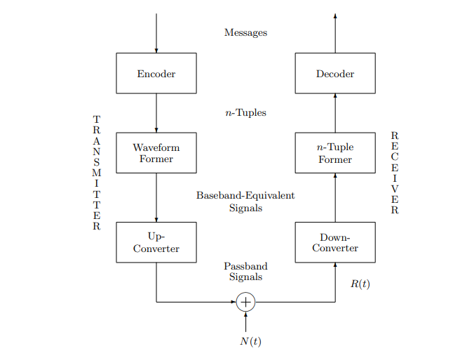
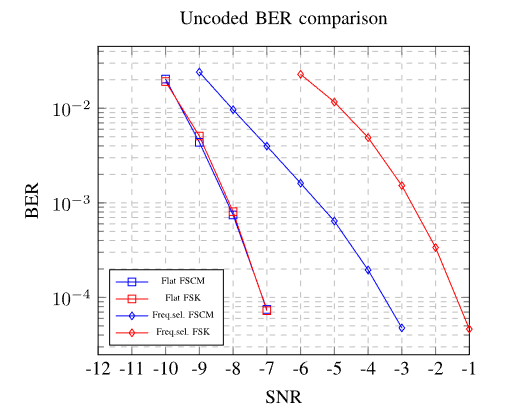

# Sistema de comunicación LoRa — de la simulación al PlutoSDR

Trabajo práctico final de **Comunicaciones Digitales** — FCEFyN, Universidad Nacional de Córdoba.
Autores: Enrique Lenox Graham y Franco Iván Mamani (grupo LenoxLegends).

Diseño e implementación en Python de un sistema de comunicación digital con modulación **LoRa** (*Chirp Spread Spectrum*), construido bloque por bloque según el modelo de Rimoldi y validado contra los resultados del paper de Vangelista (2017). Al final, se probó con hardware real: una radio definida por software **ADALM-Pluto (PlutoSDR)**.



## Módulos

| Módulo | Qué se implementó |
|---|---|
| **1. Codec** | Conversión de bits a símbolos y de símbolos a bits según el *spreading factor* (SF), con cálculo de BER. |
| **2. Waveform former** | Generación de los chirps LoRa a partir de la ecuación de Vangelista, verificación de su ortogonalidad, y demodulador con down-chirp + DFT (criterio de máxima verosimilitud), con cálculo de SER. |
| **3. Canal AWGN** | Ruido blanco gaussiano según la SNR y simulación Monte Carlo de BER y SER, comparadas con la curva del paper. |
| **4. Canal selectivo en frecuencia** | Canal con la respuesta al impulso de Vangelista y simulación Monte Carlo comparada con la curva del paper. |
| **5. PlutoSDR** | Transmisión y recepción con hardware real: loopback digital y loopback por antena, con demodulación y medición de BER. |



## Contenido

- [`Proyecto_Integrador_LenoxLegends_V3.ipynb`](Proyecto_Integrador_LenoxLegends_V3.ipynb): notebook principal, con la teoría, el código y los resultados de cada módulo.
- `How To Config SDR.ipynb`: configuración del PlutoSDR.
- `BER.png`, `rimoldi_sistema.png` y los diagramas de bloques del SDR.

## Cómo correrlo

```bash
pip install numpy matplotlib jupyter
jupyter notebook Proyecto_Integrador_LenoxLegends_V3.ipynb
```

Los módulos 1 a 4 corren solo con Python. El módulo 5 necesita un ADALM-Pluto conectado y la librería `pyadi-iio`.

## Qué aprendimos

- A llevar un modelo teórico (Rimoldi, Vangelista) a código que se puede verificar con métricas (BER y SER) y comparar con resultados publicados.
- Por qué la modulación por chirps es robusta frente al ruido y a canales selectivos en frecuencia.
- La distancia entre una simulación y el hardware real: configuración de la radio, sincronización y pérdidas en la transmisión por antena.

## Referencias

- B. Rimoldi, *Principles of Digital Communication: A Top-Down Approach*.
- L. Vangelista, "Frequency Shift Chirp Modulation: The LoRa Modulation", *IEEE Signal Processing Letters*, 2017.
